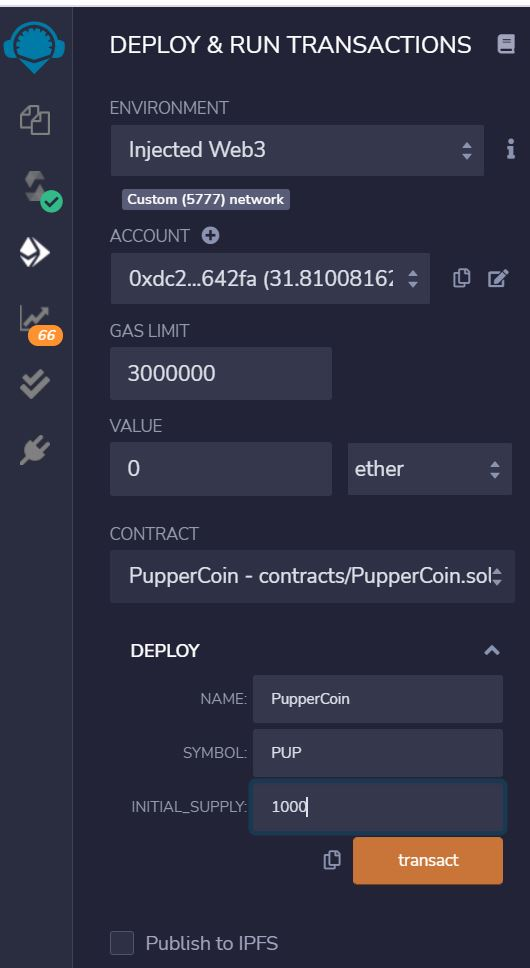

# Advanced-Solidity

## Background

Create an ERC20 token that will be minted through a Crowdsale contract that you can leverage from the OpenZeppelin Solidity library. This crowdsale contract will manage the entire process, allowing users to send ETH and get back PUP (PupperCoin). This contract will mint the tokens automatically and distribute them to buyers in one transaction.

## Solidity Contracts

Compile the codes in following solidity contracts using [remix](https://remix.ethereum.org/)
* [Pupper Coin Contract](PupperCoin.sol)
* [Crowdsale Contract](Crowdsale.sol)

## Contract Deployment

